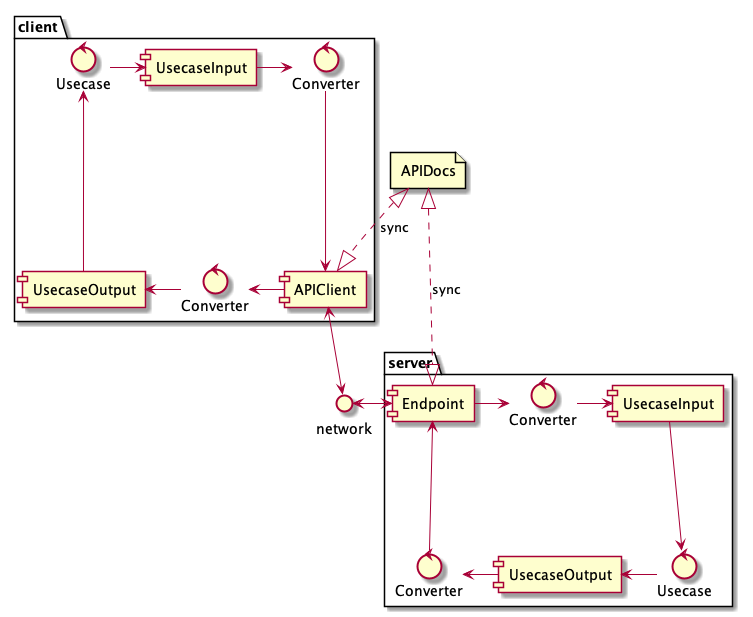
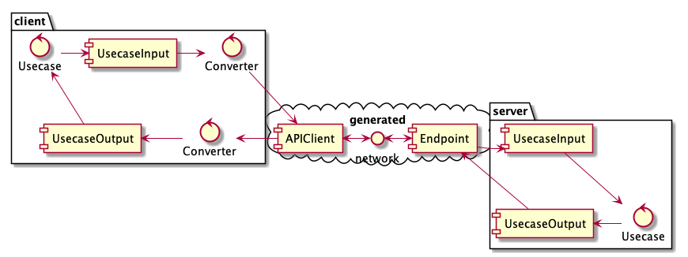

go-codegen
==========

go-codegen is a generator library for Go.

go-codegen mainly generates codes for Domain Driven Development.

## Generator Types

Currently, go-codegen provides three generation types.

### Type1: Generation by Definition of Struct

Like followings.

```go
//go:generate go-codegen go_accessor
//go:generate go-codegen go_constructor

//genconstructor
type Person struct {
	id   string                 `required:"" getter:""`
	name string                 `required:"" getter:"" setter:"Rename"`
	tags []string               `getter:"" setter:""`
	text encoding.TextMarshaler `getter:"" setter:""`
	createdAt time.Time         `required:"time.Now()"`
}
```

```go
// Code generated by go-codegen go_accessor; DO NOT EDIT.

package example

import (
	encoding "encoding"
	time "time"
)

func NewPerson(
    id string,
    name string,
) Person {
    return Person{
        id:        id,
        name:      name,
        createdAt: time.Now(),
    }
}

func (m Person) ID() string {
	return m.id
}

func (m Person) Name() string {
	return m.name
}

func (m *Person) Rename(s string) {
	m.name = s
}

func (m Person) Tags() []string {
	return m.tags
}

func (m *Person) SetTags(s []string) {
	m.tags = s
}

func (m Person) Text() encoding.TextMarshaler {
	return m.text
}

func (m *Person) SetText(s encoding.TextMarshaler) {
	m.text = s
}
```

- [go\-codegen/codegen/go\_accessor](https://github.com/hori-ryota/go-codegen/tree/master/codegen/go_accessor)
- [go\-codegen/codegen/go\_constructor](https://github.com/hori-ryota/go-codegen/tree/master/codegen/go_constructor)

### Type2: Generation from Definition of Simple Type Definition

Like followings.

```go
package example

import "errors"

//go:generate go-generror Unknown BadRequest PermissionDenied NotFound

type NameSpec struct {
	lessThan int
	moreThan int
}

func (s NameSpec) Validate(name string) Error {
	//errcode NameIsInvalidLength,lessThan int,moreThan int
	if len(name) >= s.lessThan || len(name) <= s.moreThan {
		return ErrorBadRequest(errors.New("invalid name"), NameIsInvalidLengthError(s.lessThan, s.moreThan))
	}
	return nil
}
```

```go
// Code generated ; DO NOT EDIT

package example

import (
	"fmt"
	"strconv"
	"strings"

	"github.com/hori-ryota/zaperr"
	"go.uber.org/zap"
	"go.uber.org/zap/zapcore"
)

type ErrorCode string

const (
	errorUnknown          ErrorCode = "Unknown"
	errorBadRequest       ErrorCode = "BadRequest"
	errorPermissionDenied ErrorCode = "PermissionDenied"
	errorNotFound         ErrorCode = "NotFound"
)

func (c ErrorCode) String() string {
	return string(c)
}

type Error interface {
	Error() string
	Details() []ErrorDetail

	IsUnknown() bool
	IsBadRequest() bool
	IsPermissionDenied() bool
	IsNotFound() bool
}

func newError(source error, code ErrorCode, details ...ErrorDetail) Error {
	return errorImpl{
		source:  source,
		code:    code,
		details: details,
	}
}

func ErrorUnknown(source error, details ...ErrorDetail) Error {
	return newError(source, errorUnknown, details...)
}
func ErrorBadRequest(source error, details ...ErrorDetail) Error {
	return newError(source, errorBadRequest, details...)
}
func ErrorPermissionDenied(source error, details ...ErrorDetail) Error {
	return newError(source, errorPermissionDenied, details...)
}
func ErrorNotFound(source error, details ...ErrorDetail) Error {
	return newError(source, errorNotFound, details...)
}

type errorImpl struct {
	source  error
	code    ErrorCode
	details []ErrorDetail
}

func (e errorImpl) Error() string {
	return fmt.Sprintf("%s:%s:%s", e.code, e.details, e.source)
}
func (e errorImpl) Details() []ErrorDetail {
	return e.details
}

func (e errorImpl) IsUnknown() bool {
	return e.code == errorUnknown
}
func (e errorImpl) IsBadRequest() bool {
	return e.code == errorBadRequest
}
func (e errorImpl) IsPermissionDenied() bool {
	return e.code == errorPermissionDenied
}
func (e errorImpl) IsNotFound() bool {
	return e.code == errorNotFound
}

type ErrorDetail struct {
	code ErrorDetailCode
	args []string
}

func newErrorDetail(code ErrorDetailCode, args ...string) ErrorDetail {
	return ErrorDetail{
		code: code,
		args: args,
	}
}

func (e ErrorDetail) String() string {
	return strings.Join(append([]string{e.code.String()}, e.args...), ",")
}

func (c ErrorDetail) Code() ErrorDetailCode {
	return c.code
}

func (c ErrorDetail) Args() []string {
	return c.args
}

type ErrorDetailCode string

func (c ErrorDetailCode) String() string {
	return string(c)
}

const ErrorDetailNameIsInvalidLength ErrorDetailCode = "NameIsInvalidLength"

func NameIsInvalidLengthError(
	lessThan int,
	moreThan int,
) ErrorDetail {
	return newErrorDetail(
		ErrorDetailNameIsInvalidLength,
		strconv.FormatInt(int64(lessThan), 10),
		strconv.FormatInt(int64(moreThan), 10),
	)
}

func (e errorImpl) MarshalLogObject(enc zapcore.ObjectEncoder) error {
	zaperr.ToNamedField("sourceError", e.source).AddTo(enc)
	zap.String("code", string(e.code)).AddTo(enc)
	zap.Any("details", e.details)
	return nil
}
```

- [go\-codegen/codegen/error](https://github.com/hori-ryota/go-codegen/tree/master/codegen/error)
    - Generator for type safe error
    - [go\-codegen/codegen/error/go\_definition](https://github.com/hori-ryota/go-codegen/tree/master/codegen/error/go_definition)
        - Definition of Go
    - TODO: support ProtocolBuffers definition
    - TODO: support JsonType definition
- TODO: Generator for application events
    - Rewrite from [hori\-ryota/go\-genappevent](https://github.com/hori-ryota/go-genappevent)

### Type3: Generation for "Adapter Layer" from "Application Layer" Definition

For example, in the adapter for communication API, like followings.

Before:


After:


- [go\-codegen/codegen/api](https://github.com/hori-ryota/go-codegen/tree/master/codegen/api)
    - [go\-codegen/codegen/api/protobuf](https://github.com/hori-ryota/go-codegen/tree/master/codegen/api/protobuf)
        - Generate `.proto` definition
        - [go\-codegen/codegen/api/protobuf/go\_server](https://github.com/hori-ryota/go-codegen/tree/master/codegen/api/protobuf/go_server)
            - [go\-codegen/codegen/api/protobuf/go\_server/httprpc](https://github.com/hori-ryota/go-codegen/tree/master/codegen/api/protobuf/go_server/httprpc)
                - Generate HTTP Server for RPC with proto
        - [go\-codegen/codegen/api/protobuf/go\_client](https://github.com/hori-ryota/go-codegen/tree/master/codegen/api/protobuf/go_client)
            - [go\-codegen/codegen/api/protobuf/go\_client/httprpc](https://github.com/hori-ryota/go-codegen/tree/master/codegen/api/protobuf/go_client/httprpc)
                - Generate HTTP Client for RPC with proto
            - [go\-codegen/codegen/api/protobuf/go\_client/structdef](https://github.com/hori-ryota/go-codegen/tree/master/codegen/api/protobuf/go_client/structdef)
                - Generate struct definitions for HTTP Client for RPC with proto
        - [go\-codegen/codegen/api/protobuf/kotlin\_client](https://github.com/hori-ryota/go-codegen/tree/master/codegen/api/protobuf/kotlin_client)
            - [go\-codegen/codegen/api/protobuf/kotlin\_client/httprpc](https://github.com/hori-ryota/go-codegen/tree/master/codegen/api/protobuf/kotlin_client/httprpc)
                - Generate HTTP Client for RPC with proto in Kotlin
            - [go\-codegen/codegen/api/protobuf/kotlin\_client/structdef](https://github.com/hori-ryota/go-codegen/tree/master/codegen/api/protobuf/kotlin_client/structdef)
                - Generate struct definitions for HTTP Client for RPC with proto in Kotlin
        - [go\-codegen/codegen/api/protobuf/prototoolyaml](https://github.com/hori-ryota/go-codegen/tree/master/codegen/api/protobuf/prototoolyaml)
                - Generate Yaml config file for prototool
    - Sample: [go\-codegen/codegen/api/internal/testdata](https://github.com/hori-ryota/go-codegen/tree/master/codegen/api/internal/testdata)
